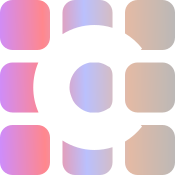
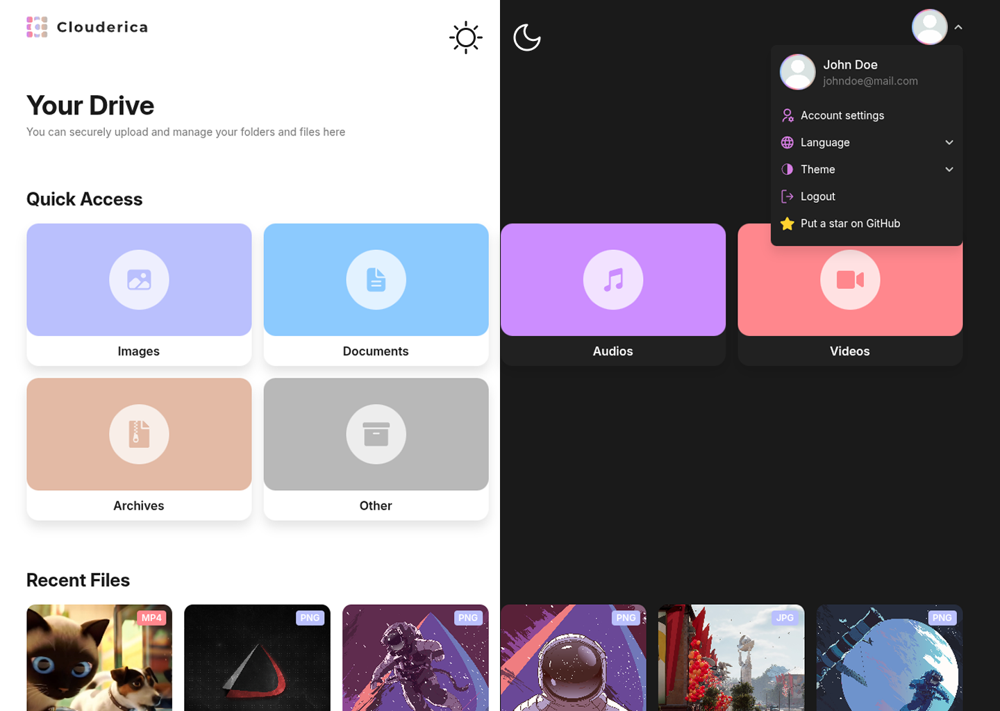
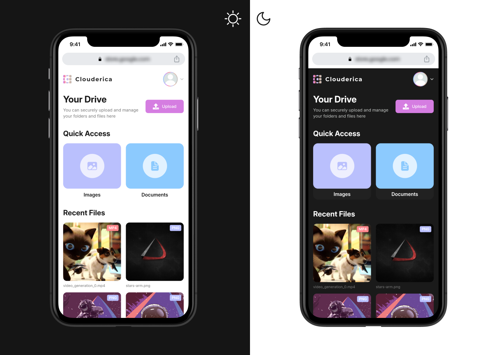

<p align="center">
	
</p>

<h1 align="center">Clouderica Cloud Storage</h1>

<p align="center">
  Modern cloud storage solution with React frontend and NestJS backend.<br/>
  Features real-time file management, secure authentication, and a seamless user experience.
</p>

<p align="center">
  <a href="https://github.com/romxnv/clouderica-frontend">Frontend Repository</a> •
  <a href="https://github.com/romxnv/clouderica-backend">Backend Repository</a>
</p>

<p align="center">
  <br/>
  
</p>

## 📦 Project Structure

This repository uses Git submodules to manage the frontend and backend:

```

clouderica/
├── clouderica-frontend/   # React + Vite (submodule)
└── clouderica-backend/    # NestJS + PostgreSQL + MinIO (submodule)

```

## 🚀 Getting Started

### 1. Clone the repository with submodules

```bash
git clone --recurse-submodules https://github.com/romxnv/clouderica.git
cd clouderica
```

### 2. Run the system locally

```bash
# Start backend (includes PostgreSQL and MinIO)
cd clouderica-backend
docker-compose -f docker-compose.dev.yml up --build

# Start frontend
cd ../clouderica-frontend
npm install
npm run dev
```

### 3. Access the application

- **Frontend**: [http://localhost:5173](http://localhost:5173)
- **Backend API**: [http://localhost:8080/api](http://localhost:8080/api)
- **MinIO Console**: [http://localhost:9001](http://localhost:9001)

## 🧰 Technology Stack

### Frontend

- [**React**](https://reactjs.org/) – Component-based UI library
- [**Vite**](https://vitejs.dev/) – Fast bundler and dev server
- [**TypeScript**](https://www.typescriptlang.org/) – Static typing for JavaScript
- [**TanStack Query**](https://tanstack.com/query/latest) – Server state and caching
- [**Zustand**](https://zustand-demo.pmnd.rs/) – Lightweight global state manager
- [**Tailwind CSS**](https://tailwindcss.com/) – Utility-first CSS framework
- [**React Hook Form**](https://react-hook-form.com/) +
  [**Zod**](https://zod.dev/) – Form handling with schema-based validation

### Backend

- [**NestJS**](https://nestjs.com/) – Scalable Node.js backend framework
- [**PostgreSQL**](https://www.postgresql.org/) – Open-source relational database
- [**Prisma**](https://www.prisma.io/) – Type-safe ORM and database toolkit
- [**MinIO**](https://min.io/) – Self-hosted, S3-compatible object storage
- [**JWT**](https://jwt.io/) – Token-based authentication
- [**Docker**](https://www.docker.com/) – Containerization for local and production environments

## 📁 Submodule Management

### Pull latest changes from submodules

```bash
git submodule update --remote
```

### Add submodules manually (if needed)

```bash
git submodule add https://github.com/romxnv/clouderica-frontend.git
git submodule add https://github.com/romxnv/clouderica-backend.git
```

> Don’t forget to commit the updated submodule references:

```bash
git add clouderica-frontend clouderica-backend
git commit -m "Update submodules"
```

## 🤝 Contributing

We welcome contributions!

This repository serves as an entry point for both the frontend and backend projects.
To contribute, please navigate to the respective repository:

- **[Frontend Issues & Contributions](https://github.com/romxnv/clouderica-frontend/issues)**
- **[Backend Issues & Contributions](https://github.com/romxnv/clouderica-backend/issues)**

You can:

1. Fork the target repository
2. Create a feature branch: `git checkout -b feature/your-feature`
3. Make your changes and commit
4. Push and open a pull request

For bug reports or feature suggestions, please open an issue in the appropriate subproject.
